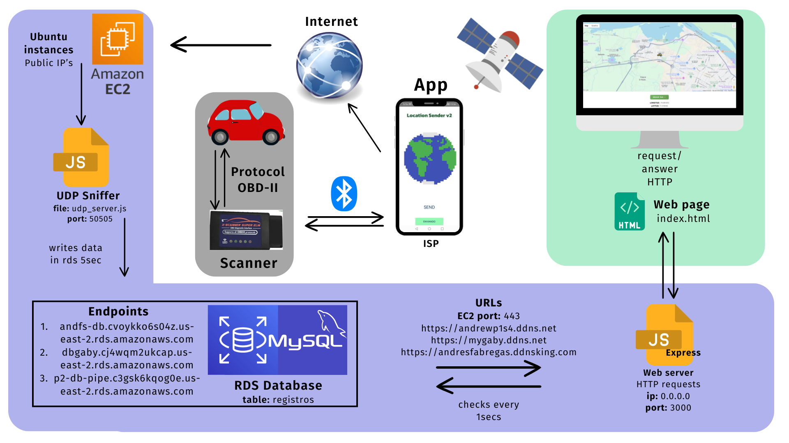
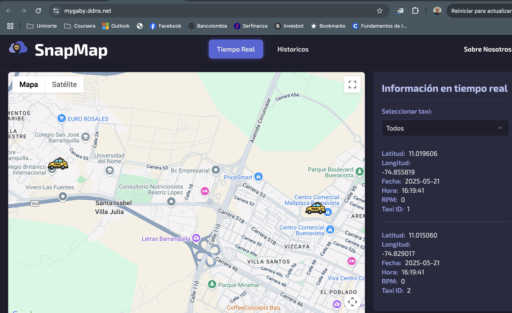
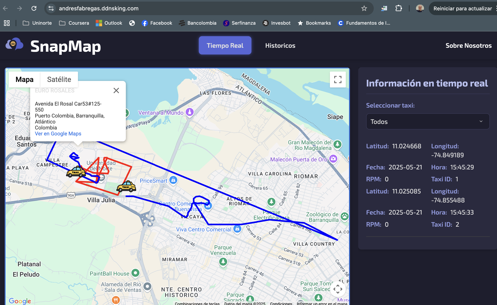

# 🟢 Taxi Geolocation & Tracking System  
### Cloud-Based Real-Time & Historical Vehicle Monitoring

 

**Cloud Computing · Real-Time Systems · Geolocation · DevOps**

---

## 🟢 Project Overview

This project implements a **cloud-based geolocation and tracking system for taxi services**, designed to provide **real-time and historical visualization of vehicle positions** with high availability, scalability, and security.

The entire infrastructure was **fully migrated to Amazon Web Services (AWS)** to improve system stability, performance, and scalability. All services — **web server, UDP server, backend API, and database** — were centralized in the cloud to guarantee continuous and reliable operation.

---

## 🟢 System Demo

 

**✔ Click to watch the full system demonstration**

---

## 🟢 Cloud Architecture (AWS)

### Infrastructure Components

| Component | Description |
|---------|-------------|
| **EC2 (Ubuntu Server)** | Hosts backend, frontend, UDP server |
| **RDS (MySQL)** | Centralized relational database |
| **Nginx** | Web server & reverse proxy |
| **PM2** | Backend process manager |
| **GitHub Actions** | CI/CD automation |
| **Security Groups** | Network isolation & access control |

---

## 🟢 Backend Architecture

The backend was developed using **Node.js** and deployed on an **EC2 instance running Ubuntu Server**.

### Core Responsibilities
- Communication between web frontend, mobile app, and database
- REST API exposure for real-time and historical data
- UDP data ingestion from mobile clients

### Main API Routes

| Route | Description |
|------|------------|
| `/api-key` | Secure delivery of Google Maps API key |
| `/data` | Real-time vehicle position retrieval |
| `/historico` | Historical route data within a time window |

---

## 🟢 UDP Server (Real-Time GPS Ingestion)

A dedicated **UDP server** was configured on **port 50505** using `udpserver.js`.

### Functionality
- Receives taxi ID, GPS coordinates, date, and time
- Converts timestamps to database-compatible format
- Stores processed data in **MySQL (AWS RDS)**

This design ensures **low latency**, **reliable ingestion**, and **real-time synchronization**.

---

## 🟢 Frontend Application

The frontend was developed using **HTML, CSS, and JavaScript**, integrating **Google Maps**.

### Key Features
- Real-time taxi location updated every second
- Custom markers
- **Follow Taxi** button
- Dynamic Polyline route visualization
- Optimized UX/UI design

---

## 🟢 Historical Route Visualization

Users can visualize **historical taxi routes within a selected time window**.

### Workflow
1. Select vehicle and time range
2. Backend query via `/historico`
3. Coordinates rendered as a Google Maps Polyline
4. Interactive route display

---

## 🟢 Multi-Vehicle Scalability

The system supports **multiple taxis simultaneously**.

### Enhancements
- Second vehicle integration via OBDII
- Vehicle selection from mobile app
- Real-time RPM visualization
- Multiple color-coded historical polylines
- Individual vehicle statistics

---

## 🟢 DevOps & CI/CD

The infrastructure is integrated with **GitHub Actions** for continuous deployment.

### Pipeline Features
- Automatic deployment on push
- Multiple branches (`main`, `andresito`, feature branches)
- Self-hosted runners
- Automated dependency installation and PM2 restarts

---

## 🟢 Testing Environment

A dedicated testing environment:
- Independent port
- Branch-specific deployment
- Isolated from production

Nginx handles multiple environments and routing.

---

## 🟢 Security Measures

- Ports enabled:
  - **80 / 443** (HTTP / HTTPS)
  - **22** (SSH restricted)
- Database access limited to EC2
- Credentials stored securely in `.env` files

---

## 🟢 Technology Stack

### Backend
- Node.js
- PM2
- UDP Server
- MySQL (AWS RDS)

### Frontend
- HTML
- CSS
- JavaScript
- Google Maps API
- Polyline rendering

### Cloud & DevOps
- AWS EC2
- AWS RDS
- Nginx
- GitHub Actions
- Ubuntu Server

---

## 🟢 Developed By

<strong>
Andrés Fábregas · Gabriela Becerra · Ali Rada · Luciana de la Rosa · Andrés Narváez
</strong>

 

**Electronic Engineer · Software Developer · Cloud & Backend Systems**

 

*Designed for scalability, reliability, and real-time performance*

